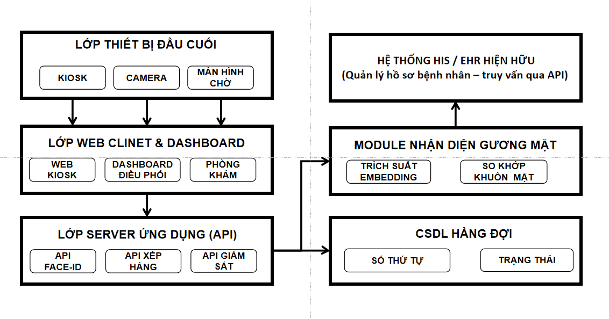
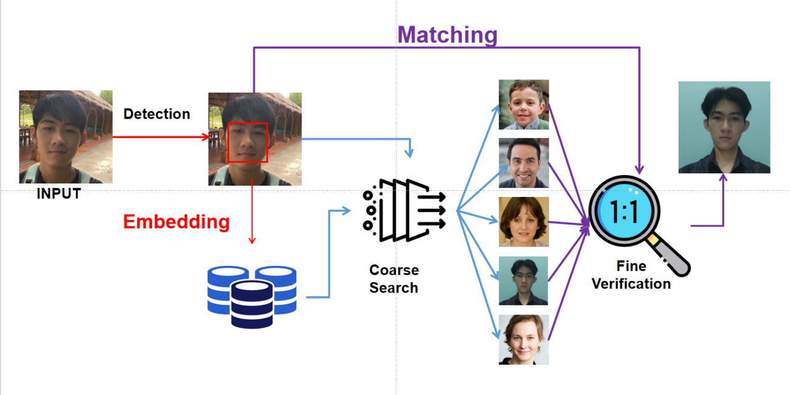
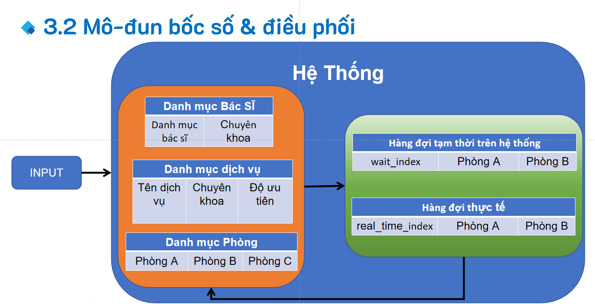

# Hệ thống API định danh bệnh nhân bằng nhận diện khuôn mặt  
## Điều phối hàng đợi thời gian thực cho chuyển đổi số y tế

> 📌 Repository nghiên cứu phục vụ **luận văn tốt nghiệp** – hướng tiếp cận API-centric, Face ID và hệ thống realtime.

---

## 🧾 Tóm tắt
Repository này trình bày quá trình nghiên cứu và xây dựng một hệ thống API phục vụ **định danh bệnh nhân bằng nhận diện khuôn mặt** kết hợp **bốc số và điều phối hàng đợi khám bệnh theo thời gian thực**.  

Hệ thống được thiết kế theo hướng **API-centric**, cho phép tích hợp linh hoạt với kiosk tiếp nhận, bảng hiển thị và các hệ thống quản lý y tế hiện có.

Giải pháp sử dụng **mô hình học sâu ArcFace (InsightFace)** để trích xuất đặc trưng khuôn mặt, kết hợp **cơ sở dữ liệu vector FAISS** nhằm tối ưu tốc độ so khớp. Đồng thời, **WebSocket** được áp dụng để đảm bảo cập nhật trạng thái hàng đợi theo thời gian thực với độ trễ thấp.

---

## 1. Đặt vấn đề
Trong các cơ sở y tế, quy trình tiếp nhận bệnh nhân và quản lý hàng đợi vẫn còn phụ thuộc nhiều vào thao tác thủ công, dẫn đến tình trạng ùn tắc, sai sót định danh và trải nghiệm người bệnh chưa tối ưu.

Việc ứng dụng **nhận diện khuôn mặt** kết hợp **hệ thống điều phối hàng đợi theo thời gian thực** là một hướng tiếp cận phù hợp với xu thế chuyển đổi số y tế hiện nay.

**Mục tiêu chính của đề tài:**
- Định danh bệnh nhân nhanh chóng, chính xác, không phụ thuộc thẻ giấy
- Quản lý và điều phối hàng đợi minh bạch, linh hoạt và hiệu quả

---

## 2. Cơ sở lý thuyết: AI – Học máy – Học sâu

**Trí tuệ nhân tạo (Artificial Intelligence – AI)** là lĩnh vực nghiên cứu trong khoa học máy tính nhằm xây dựng các hệ thống có khả năng thực hiện những nhiệm vụ vốn đòi hỏi trí tuệ con người, như nhận thức, suy luận và ra quyết định.

**Học máy (Machine Learning – ML)** là một nhánh của AI, cho phép hệ thống tự động học ra quy luật từ dữ liệu thay vì được lập trình bằng các luật cố định.

**Học sâu (Deep Learning – DL)** là một nhánh con của ML, sử dụng mạng nơ-ron nhiều tầng để tự động học đặc trưng từ dữ liệu thô, đặc biệt hiệu quả trong các bài toán thị giác máy tính và nhận diện khuôn mặt.

> 🎯 Trong phạm vi đề tài này, hệ thống sử dụng **mô hình học sâu ArcFace**, thuộc **học máy**, và là một ứng dụng cụ thể của **AI trong y tế**.

---

## 3. Kiến trúc tổng thể hệ thống

*Hình 1. Kiến trúc tổng thể hệ thống.*

Hệ thống được thiết kế theo mô hình phân lớp:
- **Thiết bị đầu cuối:** kiosk, camera, bảng hiển thị
- **Server ứng dụng:** các API Face ID và hàng đợi
- **Xử lý nhận diện:** mô-đun Face ID độc lập
- **Dữ liệu:** CSDL quan hệ và FAISS vector database

Thiết kế này giúp hệ thống **dễ mở rộng, dễ bảo trì** và thuận tiện tích hợp HIS/EHR.

---

## 4. Xây dựng và triển khai hệ thống API

### 4.1 Định hướng thiết kế
Hệ thống được xây dựng theo hướng **API-first**, tách biệt rõ giao diện người dùng và logic nghiệp vụ. Backend triển khai bằng **FastAPI**, hỗ trợ xử lý bất đồng bộ và phù hợp với các yêu cầu thời gian thực.

### 4.2 Mô-đun nhận diện khuôn mặt

*Hình 2. Quy trình nhận diện khuôn mặt.*

Pipeline gồm:
1. Phát hiện và chuẩn hóa khuôn mặt  
2. Trích xuất vector đặc trưng (ArcFace – 512D)  
3. So khớp định danh bằng FAISS  

> 🔐 Hệ thống **không lưu ảnh gốc**, chỉ lưu vector đặc trưng để đảm bảo quyền riêng tư.

### 4.3 Bốc số và quản lý hàng đợi
Mô-đun hàng đợi chịu trách nhiệm:
- Cấp số khám
- Gán bệnh nhân vào hàng đợi phù hợp
- Theo dõi và cập nhật trạng thái khám

Xung đột khi nhiều kiosk hoạt động đồng thời được xử lý bằng **khóa logic ở tầng ứng dụng**.

### 4.4 Điều phối hàng đợi hai lớp theo thời gian thực

*Hình 3. Mô hình điều phối hàng đợi hai lớp.*

- **Lớp dịch vụ:** phân loại theo loại hình khám  
- **Lớp phòng/bác sĩ:** điều phối theo nguồn lực thực tế  

Giải pháp giúp giảm quá tải cục bộ và tối ưu luồng bệnh nhân.

---

## 5. Thử nghiệm và đánh giá
Hệ thống được thử nghiệm trong môi trường mô phỏng phòng khám quy mô vừa:
- ⏱ Thời gian nhận diện: < 100 ms  
- 🔄 Độ trễ realtime: < 200 ms  
- ⚙ Hoạt động ổn định với nhiều yêu cầu đồng thời  

---

## 6. Đóng góp của đề tài
- Đề xuất kiến trúc API cho định danh bệnh nhân và quản lý hàng đợi  
- Triển khai mô-đun Face ID có khả năng mở rộng  
- Xây dựng mô hình điều phối hàng đợi hai lớp theo thời gian thực  

---

## 7. Hạn chế và hướng phát triển

**Hạn chế**
- Hệ thống ở mức prototype  
- Chưa triển khai thực tế tại bệnh viện  
- Chưa tích hợp chuẩn HIS/EHR  

**Hướng phát triển**
- Tích hợp HL7/FHIR  
- Triển khai cloud/edge  
- Xác thực đa yếu tố (Face ID + QR/NFC)  

---

## 👤 Thông tin tác giả
- **Tác giả:** Nguyễn Hoàng Khánh  
- **MSSV:** B2113312  
- **Ngành:** Khoa học Máy tính  
- **Trường:** Đại học Cần Thơ  
- **GVHD:** TS. Lưu Tiến Đạo  
- **Năm:** 2025  

---

## 📄 Giấy phép
Dự án phục vụ **mục đích học tập và nghiên cứu**.  
Không sử dụng cho mục đích thương mại khi chưa có sự cho phép của tác giả.
